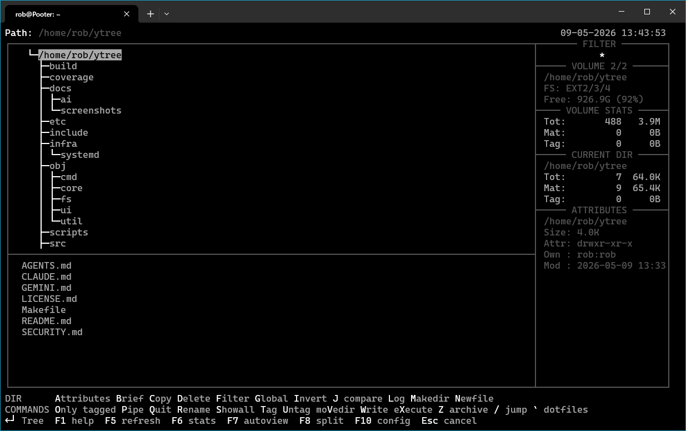
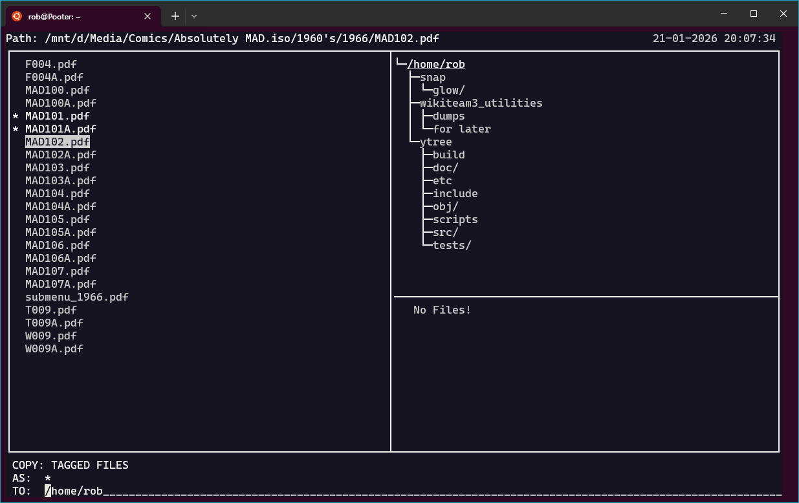

# **ytree - The Unix File Logger**
---
> [!IMPORTANT]
> **STATUS: ALPHA (v3.0.0-alpha)**
> `ytree` is in active alpha development. Expect rough edges, incomplete behaviour, and occasional regressions. Interfaces, key bindings, and configuration details may change before the first stable release.
> Before opening an issue or suggesting a feature, check [BUGS.md](docs/BUGS.md) and [ROADMAP.md](docs/ROADMAP.md) first, so as not to create a duplicate if it is already listed.

Ytree gives you a fast, keyboard-first view of logged storage: a directory tree, a file list for the current directory, and Showall for all files in the current volume (plus Global across logged volumes). You can filter and tag files, then run normal file operations (copy, move, rename, delete, archive, edit) on single files or in bulk. It also includes built-in file preview, file/directory compare tools, split-screen workflows, and archive-as-directory support with archive creation plus in-archive write operations (copy/move/rename/delete/mkdir where supported).

---

**Ytree** is a file manager for UNIX-like systems (Linux, BSD, etc.), optimized for speed and keyboard efficiency.

## Background

Born from the lineage of [XTree&trade;](https://www.xtreefanpage.org/lowres/x10dirja.htm) (DOS), `ytree` was intended to be the definitive tree-based logger for Unix. While it has been maintained for compatibility over the decades, its feature set remained largely frozen in the late 1990s, leaving **Unix power users** without a true equivalent to the powerful "log and tag" workflow.

Many file managers today function as "browsers"—they look at one directory at a time and rely on the OS to fetch files on demand. `Ytree` is different: it is a **Logger**. It scans ("logs") entire drive hierarchies into memory. This treats the filesystem as a database, allowing you to **Show All** files in a flat view, filter across thousands of subdirectories instantly, and perform bulk operations on tagged files regardless of their location.

This v3.0 project focuses on feature completeness for Unix power users, including split-screen and integrated autoview. The move to a modular C99/POSIX architecture is a practical side effect of delivering those capabilities safely and maintainably.

## Development Methodology

This refactor serves as a case study in using Large Language Models (LLMs) to evolve legacy code toward feature completeness and maintainability. The codebase was not simply "ported"; it was systematically disassembled and re-architected. An LLM was utilized to analyze the original K&R C source, understand the undocumented logic, and reimplement it using C99/POSIX standards, the MVC pattern, and strict encapsulation. This demonstrates that with persistence and strict architectural guidance, AI tools can be effectively used to maintain and improve serious systems software.

## Features (v3.0.0-alpha)

*   **Classic XTree&trade; Interface:** Directory Tree + File List layout.
*   **Split Screen Mode (F8):** Manage two independent file panels side-by-side.
*   **File Preview (F7):** Instant view of file contents without launching external tools.
*   **Multi-Volume Support:** Log multiple drives or archives simultaneously and switch instantly.
*   **Archives as Directories:** Browse ZIP, TAR, GZ, and ISO files transparently using `libarchive`.
*   **Advanced Filtering:** Filter by RegEx, Attribute, Date, and Size.
*   **Modern Architecture:** Clean C99, strict context-passing design — no global mutable state. See [ARCHITECTURE.md](docs/ARCHITECTURE.md).
*   **Auto-Refresh:** Inotify integration for live directory updates.
*   **External Viewers:** Associate specific file extensions with external programs (images, PDFs, etc.).
*   **User Commands:** Bind keys to custom shell commands/scripts for infinite extensibility.

## Screenshots

<details>
<summary>Click to view Gallery</summary>

**1. The Classic Interface**
Visualize and navigate your directory hierarchy instantly.


**2. Split Screen & Archives**
Manage two independent panels. Here, browsing an ISO on the left and copying files directly to the Home Directory on the right.


**3. Integrated Preview**
Inspect file contents without leaving the file manager. (Shown: Previewing a file *inside* an ISO archive).


</details>

## Installation

### Prerequisites

*   **C Compiler** (GCC or Clang; Clang is required for fuzz targets)
*   **ncurses** (libncurses-dev / ncurses-devel)
*   **readline** (libreadline-dev / readline-devel)
*   **libarchive** (libarchive-dev / libarchive-devel)
*   **lcov** (for baseline coverage reports)
*   **llvm-symbolizer** (recommended for sanitizer/fuzz stack traces)

### Build from Source

```bash
# Clone the repository
git clone https://github.com/robkam/ytree.git
cd ytree

# Compile (Optimized Release Build)
make

# Install
sudo make install

# Uninstall
sudo make uninstall
```

*Note: Developers can compile with AddressSanitizer enabled by running `make DEBUG=1`.*

## Documentation Guide

The project documentation is split into several focused files.

| Document | Purpose |
| :--- | :--- |
| **[USAGE.md](docs/USAGE.md)** | **User Guide**: How to navigate, tag, and use command keys. (Generated from `ytree.1.md`). |
| **[BUGS.md](docs/BUGS.md)** | **Known Issues**: Current defects, reproductions, and fix status. |
| **[CONTRIBUTING.md](docs/CONTRIBUTING.md)** | **Developer Setup**: How to set up the environment, run tests, and submit code. |
| **[PR_GATE.md](docs/PR_GATE.md)** | **PR Governance**: Required PR gate checks and triage rules needed for merge readiness. |
| **[AUDIT.md](docs/AUDIT.md)** | **QA Workflow**: The mandatory safety/integrity checks for every PR (Valgrind, ASan, etc). |
| **[SPECIFICATION.md](docs/SPECIFICATION.md)** | **Behavioral Contract**: UI layout, navigation protocols, and design philosophy. |
| **[ARCHITECTURE.md](docs/ARCHITECTURE.md)** | **System Design**: Core technical principles (DRY, SRP, Context-passing) and data hierarchy. |
| **[TRUST.md](docs/TRUST.md)** | **Trust & Safety**: Safety claims and where to verify them in the codebase. |
| **[ROADMAP.md](docs/ROADMAP.md)** | **Future Plans**: Pending milestones and prioritized delivery backlog. |
| **[CHANGES.md](docs/CHANGES.md)** | **Changelog**: Detailed history of v3.0 feature delivery, architecture work, and updates. |

---

## Reporting Issues

If you find anything amiss, you can report it using [GitHub Issues](https://github.com/robkam/ytree/issues).

For security-sensitive bugs, report privately via [SECURITY.md](SECURITY.md).

Feature requests and enhancement ideas are welcome too. Suggestions are appreciated, but not every request can be implemented.

It will help us to address the issue if you include the following:
*   **OS & Configuration:** (Distro, Terminal type, etc.)
*   **Ytree version:**
*   **Steps to Reproduce:**
*   **Expected Behavior:**
*   **Actual Behavior:**

## Contributing

Contributions are welcome! Please read [CONTRIBUTING.md](docs/CONTRIBUTING.md) for guidelines. See [SPECIFICATION.md](docs/SPECIFICATION.md) for behavioral requirements, and [ARCHITECTURE.md](docs/ARCHITECTURE.md) to understand the system design before submitting code.
Contributions do not need to be low-level C internals: bug reports, documentation updates, typo fixes, wording/UX clarifications, and translations are all valuable.

## License

Ytree is free software distributed under the GPL. See the [LICENSE.md](LICENSE.md) file for details.

## Contributors

For detailed authorship, see [AUTHORS.md](docs/AUTHORS.md).
