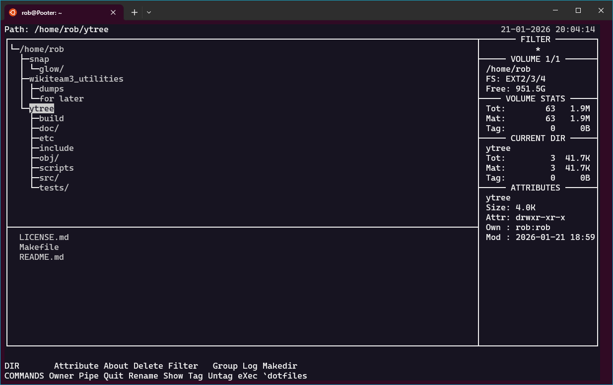
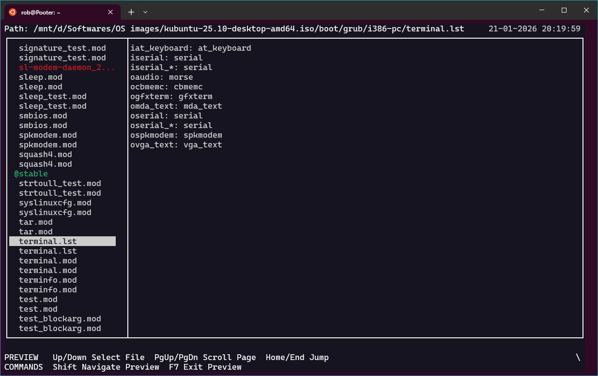

# **ytree - The Unix File Logger**
---
> [!IMPORTANT]
> **STATUS: ALPHA (v3.0.0-alpha)**
> This is a major modernization of the original `ytree`, transitioning to a modular C99/POSIX architecture. While functional, it is considered alpha as UI/UX tightening and stability refinements continue.

**Ytree** is a keyboard-optimized file manager for all POSIX-compliant **Unix** systems (Linux, BSD, macOS, etc.). Unlike traditional "browsers," `ytree` is a **Logger**: it scans directory hierarchies into memory, allowing for instant filtering, tagging, and bulk operations across the entire filesystem.

---

**Ytree** is a file manager for UNIX-like systems (Linux, BSD, etc.), optimized for speed and keyboard efficiency.

## Background

Born from the lineage of [XTree&trade;](https://www.xtreefanpage.org/lowres/x10dirja.htm) (DOS), `ytree` was intended to be the definitive tree-based logger for Unix. While it has been maintained for compatibility over the decades, its feature set remained largely frozen in the late 1990s, leaving **Unix power users** without a true equivalent to the powerful "log and tag" workflow.

Many file managers today function as "browsers"—they look at one directory at a time and rely on the OS to fetch files on demand. `Ytree` is different: it is a **Logger**. It scans ("logs") entire drive hierarchies into memory. This treats the filesystem as a database, allowing you to **Show All** files in a flat view, filter across thousands of subdirectories instantly, and perform bulk operations on tagged files regardless of their location.

This v3.0 project modernizes `Ytree` to fulfill its potential, introducing features required by modern power users (like split-screen and integrated autoview) while moving to a clean, modern C99 architecture.

## Development Methodology

This refactor serves as a case study in using Large Language Models (LLMs) to modernize legacy code. The codebase was not simply "ported"; it was systematically disassembled and re-architected. An LLM was utilized to analyze the original K&R C source, understand the undocumented logic, and reimplement it using modern C99 standards, the MVC pattern, and strict encapsulation. This demonstrates that with persistence and strict architectural guidance, AI tools can be effectively used to maintain and improve serious systems software.

## Features (v3.0.0-alpha)

*   **Classic XTree&trade; Interface:** Directory Tree + File List layout.
*   **Split Screen Mode (F8):** Manage two independent file panels side-by-side.
*   **File Preview (F7):** Instant view of file contents without launching external tools.
*   **Multi-Volume Support:** Log multiple drives or archives simultaneously and switch instantly.
*   **Archives as Directories:** Browse ZIP, TAR, GZ, and ISO files transparently using `libarchive`.
*   **Advanced Filtering:** Filter by RegEx, Attribute, Date, and Size.
*   **Modern Architecture:** Clean C99, strict context-passing design — no global mutable state. See [ARCHITECTURE.md](doc/ARCHITECTURE.md).
*   **Auto-Refresh:** Inotify integration for live directory updates.
*   **External Viewers:** Associate specific file extensions with external programs (images, PDFs, etc.).
*   **User Commands:** Bind keys to custom shell commands/scripts for infinite extensibility.

## Screenshots

<details>
<summary>Click to view Gallery</summary>

**1. The Classic Interface**
Visualize and navigate your directory hierarchy instantly.


**2. Split Screen & Archives**
Manage two independent panels. Here, browsing an ISO on the left and copying files directly to the Home Directory on the right.


**3. Integrated Preview**
Inspect file contents without leaving the file manager. (Shown: Previewing a file *inside* an ISO archive).


</details>

## Installation

### Prerequisites

*   **C Compiler** (GCC tested; Clang unverified)
*   **ncurses** (libncurses-dev / ncurses-devel)
*   **readline** (libreadline-dev / readline-devel)
*   **libarchive** (libarchive-dev / libarchive-devel)

### Build from Source

```bash
# Clone the repository
git clone https://github.com/robkam/ytree.git
cd ytree

# Compile (Optimized Release Build)
make

# Install
sudo make install

# Uninstall
sudo make uninstall
```

*Note: Developers can compile with AddressSanitizer enabled by running `make DEBUG=1`.*

## Documentation Guide

The project documentation is split into several focused files.

| Document | Purpose |
| :--- | :--- |
| **[USAGE.md](doc/USAGE.md)** | **User Guide**: How to navigate, tag, and use command keys. (Generated from `ytree.1.md`). |
| **[CONTRIBUTING.md](doc/CONTRIBUTING.md)** | **Developer Setup**: How to set up the environment, run tests, and submit code. |
| **[ARCHITECTURE.md](doc/ARCHITECTURE.md)** | **System Design**: Core technical principles (DRY, SRP, Context-passing) and data hierarchy. |
| **[SPECIFICATION.md](doc/SPECIFICATION.md)** | **Behavioral Contract**: UI layout, navigation protocols, and design philosophy. |
| **[CHANGES.md](doc/CHANGES.md)** | **Changelog**: Detailed history of the v3.0 modernization and feature updates. |
| **[ROADMAP.md](doc/ROADMAP.md)** | **Future Plans**: Pending milestones and the modernization backlog. |
| **[AUDIT.md](doc/AUDIT.md)** | **QA Workflow**: The mandatory safety/integrity checks for every PR (Valgrind, ASan, etc). |

---

## Reporting Issues

If you find anything amiss, you can report it using [GitHub Issues](https://github.com/robkam/ytree/issues).

It will help us to address the issue if you include the following:
*   **OS & Configuration:** (Distro, Terminal type, etc.)
*   **Ytree version:**
*   **Steps to Reproduce:**
*   **Expected Behavior:**
*   **Actual Behavior:**

## Contributing

Contributions are welcome! Please read [CONTRIBUTING.md](doc/CONTRIBUTING.md) for guidelines. See [SPECIFICATION.md](doc/SPECIFICATION.md) for behavioral requirements, and [ARCHITECTURE.md](doc/ARCHITECTURE.md) to understand the system design before submitting code.

## License

Ytree is free software distributed under the GPL. See the [LICENSE.md](LICENSE.md) file for details.

## Contributors

For detailed authorship, see [AUTHORS.md](doc/AUTHORS.md).
